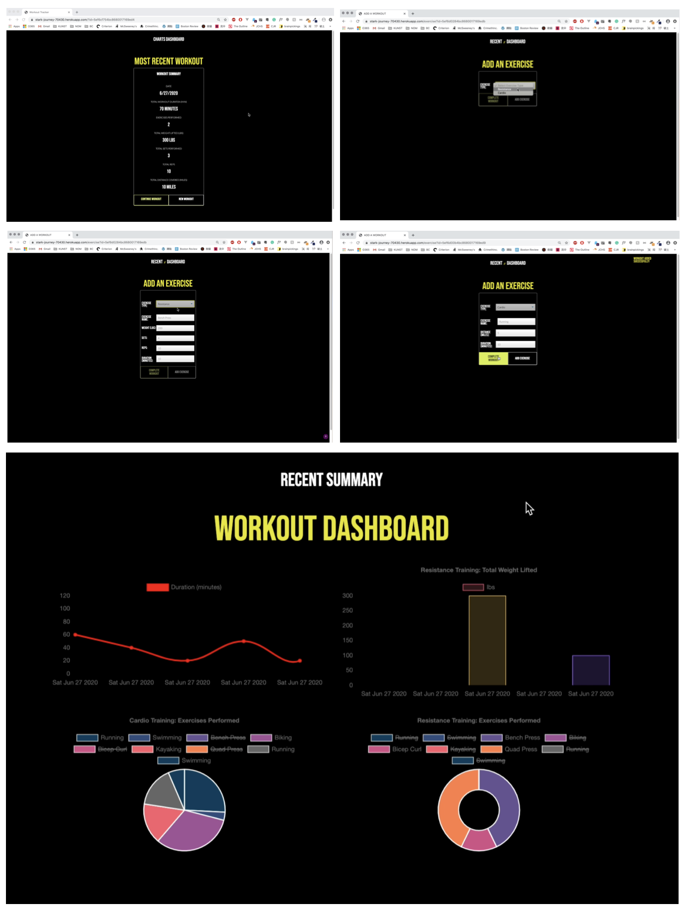

# Workout Tracker

Workout logger that allows user to save/add workouts, view the most recent workout summary, as well as view an overall workout summary in chart form on a dashboard. The user will be able to save cardio or resistance exercises. For cardio exercises, the user will be able to input exercise name, duration, and distance. For resistance exercises, the user will be able to input exercise name, duration, weight, sets, and reps. A mongo database has been created with a mongoose schema. Routes are handled with express. 

## Tech
* node.js
* express.js
* mongoDB
* mongoose

## Process
1. Created workout database on mongoDB
2. Created Workout schema/ subschema in models/workoutModel.js
3. Export Workout module using models/index.js 
4. Added routes.js 
    - create workout: post route using .create()
    - get workouts: get route using .find()
    - add to existing workout: put route using .findOneAndUpdate()
5. Get duration to tally and display using .reduce()
6. Get unit measurements to be displayed for applicable properties - looping through key - nested object
7. Edits to css
8. Edits to stats.js 

## Deployed
[Link - deployed on Heroku](https://stark-journey-70430.herokuapp.com)

## Screenshots 
